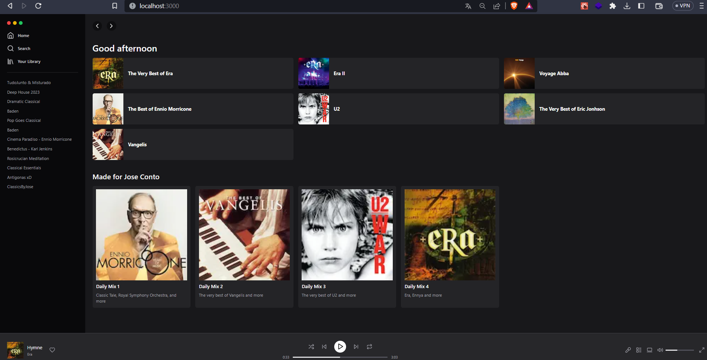

  

<h3 align="center">
Uma tentativa de recriar uma página estática do <strong>Spotify</strong> com <strong>ReactJS</strong> e <strong>TailwindCSS</strong> 
</h3>
<h3 align="center">Acesse a página <a href="https://tailwind-spotify-ponqueli.vercel.app/" target="_blank">>>aqui<<</a></h3>

 

  
   
  

  

 

## Tecnologias

